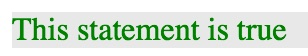
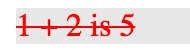

# assert.js - Simple assertions for javascript
Assertions for javascript with output to the browser

assert.js adds asserions to javascript and outputs results to the browser. It's useful for simple debugging, in cases where writing tests is overkill and you'd rather have the results displayed on the browser instead of having to open dev tools.

It's useful for expressions that you want to see pass/fail based on [truthyness](https://developer.mozilla.org/en-US/docs/Glossary/Truthy) and [falseyness](https://developer.mozilla.org/en-US/docs/Glossary/Falsy).

## Usage

*   Add assert.min.js to your scripts.
*   Call the assert() fuction. Assert takes two parameters. The first parameter is a javascript expression. The second parameter is a string that describes what the assertion was testing (the assertion message).
*   The assertion "passes" if the expression evaluates to a truthy value and fails otherwise.
*   The results are rendered on the html page, as divs attached directly onto the document body.
*   The result consists of the assertion message and is styled in green for a passing assertion, strikethrough red for a failing assertion.

## Example

`assert(true, "This statement is true")` outputs the following: 

`assert( 1 + 2 === 5, "1 + 2 is 5")` outputs the following: 
